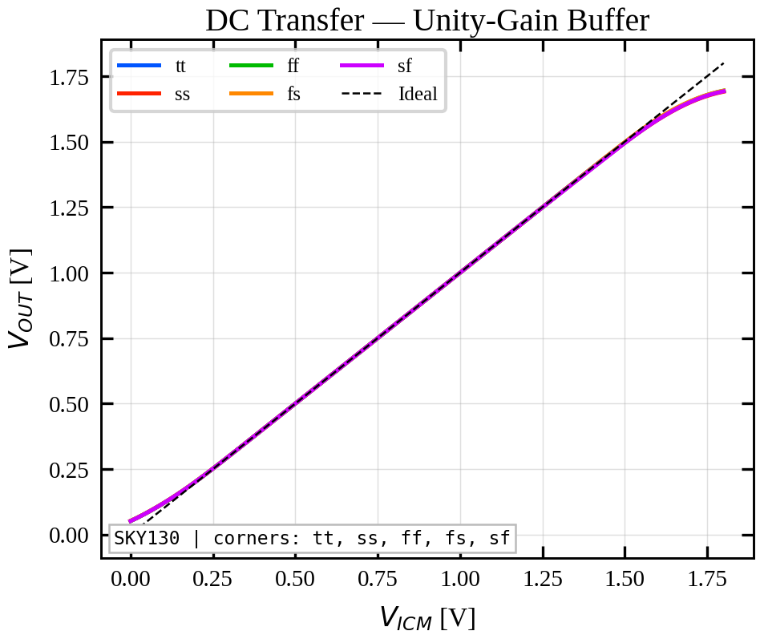
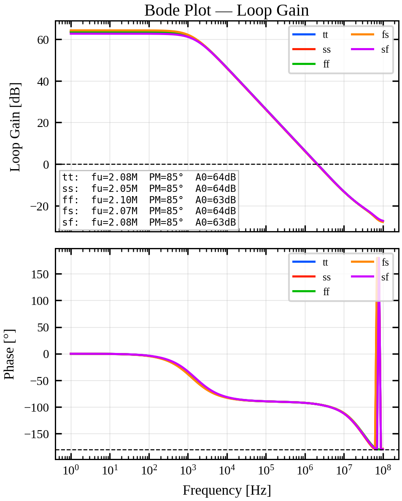
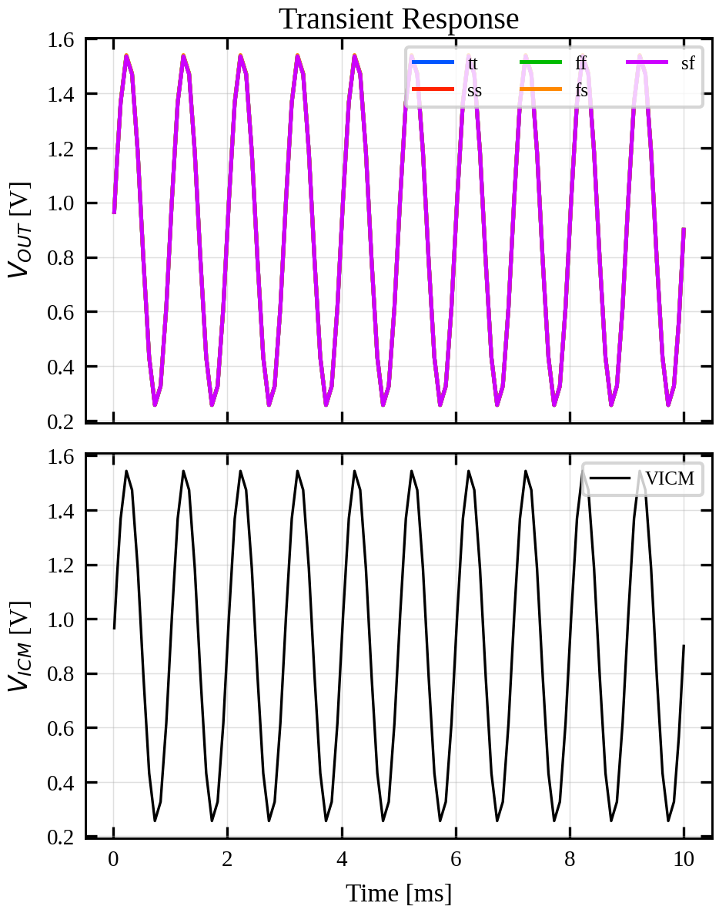
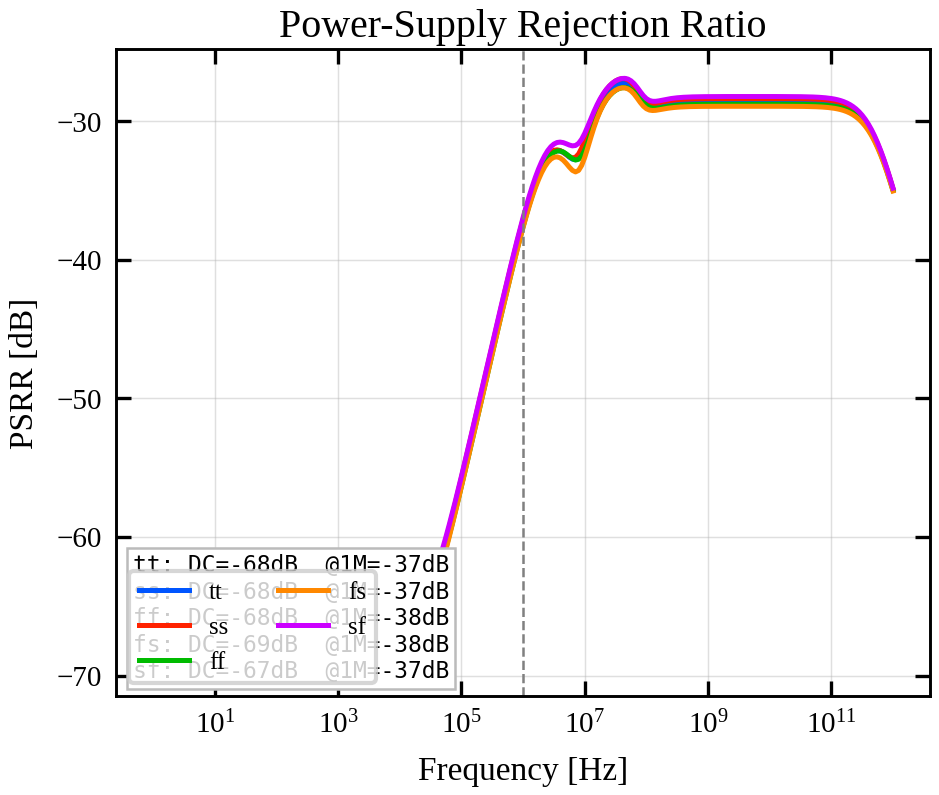
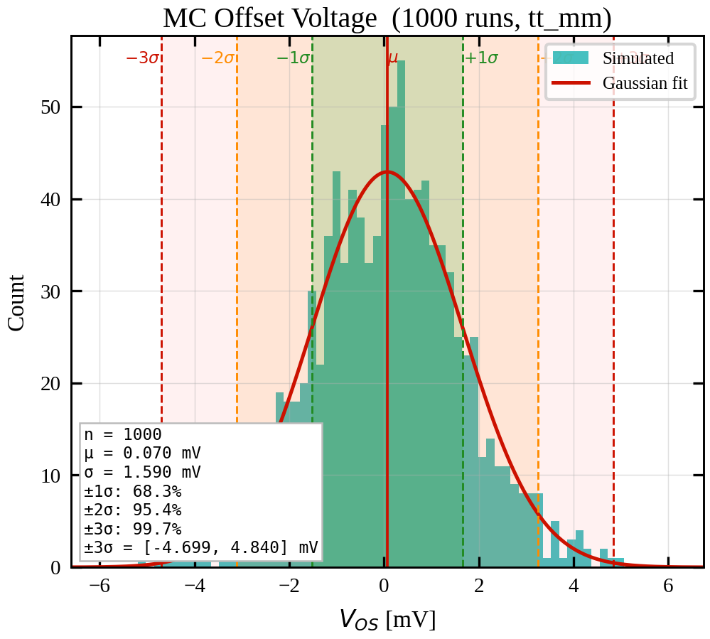

# Rail-to-Rail Input OTA IP — SKY130 PDK

> **Author:** Nithin Purushothama  
> **PDK:** SkyWater SKY130 (sky130A)  
> **Toolchain:** Xschem · Ngspice · Magic VLSI · Netgen  
> **Last Updated:** 2026-07-12
> **Area:** 47.15µmx47.15µm

---

## Table of Contents

1. [Overview](#overview)
2. [Architecture](#architecture)
3. [Design Methodology](#design-methodology)
4. [Schematic](#schematic)
5. [Simulation Results](#simulation-results)
   - [DC Transfer Characteristics](#1-dc-transfer-characteristics)
   - [Stability (Loop Gain & Phase)](#2-stability-loop-gain--phase)
   - [Transient Response](#3-transient-response)
   - [PSRR](#4-psrr)
   - [Monte Carlo — Input-Referred Offset](#5-monte-carlo--input-referred-offset)
6. [Performance Summary](#performance-summary)
7. [File Structure](#file-structure)

---

## Overview

This IP implements a **rail-to-rail input swing OTA** in the SkyWater 130 nm SKY130 PDK. The design achieves full input common-mode range (0 V to V<sub>DD</sub>) by employing complementary PMOS and NMOS differential input pairs, both folded into a shared cascode output stage. The OTA is designed for 1.8 V supply with simulations across all five process corners (tt, ss, ff, fs, sf) and Monte Carlo mismatch analysis.

---

## Architecture

The OTA is built on a **folded-cascode topology** with the following key architectural choices:

- **Complementary input pairs:** A PMOS differential pair (active near V<sub>DD</sub>) and an NMOS differential pair (active near GND) are operated in parallel. This combination ensures that at least one pair remains in saturation for any input common-mode voltage between 0 V and V<sub>DD</sub>, yielding true rail-to-rail input swing.
- **Folded cascode output stage:** Both input pair drain currents are folded and summed at a shared cascode output node, providing high output impedance and consequently high DC gain without a second gain stage.
- **Enable/disable switches (EN / EN_B):** Dedicated PMOS (MP_SW1, MP_SW3) and NMOS (MN_SW1, MN_SW2) switches allow the bias network and input pairs to be independently enabled, enabling power gating.
- **Separate PMOS and NMOS bias trees:** Cascoded bias mirrors (VBP_CASC, VBN_CASC) generated from a 1 µA reference set the quiescent operating point of all branches. The PMOS diff-pair bias (~8 µA total) and NMOS diff-pair bias (~8 µA total) are sized for symmetric g<sub>m</sub> contribution across the input range.
- **LVT input transistors:** The differential pair devices use `pfet_01v8_lvt` and `nfet_01v8_lvt` to maximise g<sub>m</sub>/I<sub>D</sub> and extend input range toward the rails.

---

## Design Methodology

Transistor sizing was performed using the **g<sub>m</sub>/I<sub>D</sub> design methodology**:

- PMOS diff pair: g<sub>m</sub>/I<sub>D</sub> = 19, I<sub>D</sub>/W = 0.037 µA/µm → sized at 28 × 4/2 (fingers × W/L)
- NMOS diff pair: g<sub>m</sub>/I<sub>D</sub> = 20, I<sub>D</sub>/W = 0.22 µA/µm → sized at 8 × 2.5/2
- Cascode bias source (PMOS): g<sub>m</sub>/I<sub>D</sub> = 10, V<sub>dsat</sub> = 200 mV → sized at 1 × 2/2
- Cascode bias source (NMOS): g<sub>m</sub>/I<sub>D</sub> = 10, V<sub>dsat</sub> = 200 mV, I<sub>D</sub>/W = 2.3 µA/µm → sized at 1 × 0.5/2

The folded cascode topology was chosen over a two-stage Miller-compensated OTA to avoid the need for a compensation capacitor while maintaining a clean single-pole dominant response up to the UGF.

---

## Schematic


> Full schematic: `SCH/Rail_to_Rail_IP_OP_OTA_with_Intrenal_Bias.sch` (Xschem)

Key nodes and current budgets annotated on schematic:

| Branch | Quiescent Current |
|---|---|
| PMOS cascode bias tree | ~1 µA |
| NMOS cascode bias tree | ~1 µA |
| PMOS diff pair (each side) | ~8 µA |
| NMOS diff pair (each side) | ~8 µA |
| Output cascode (L1 + L2) | ~2 µA + 4 µA per side |

---
## Area Estimate: 
47.15µmx47.15µm (This is Schematic based approximation and not based on real layout)


---

## Simulation Results

All simulations were run across **5 PVT corners** (tt, ss, ff, fs, sf) at T = 27°C, V<sub>DD</sub> = 1.8 V unless noted. Monte Carlo used N = 200 runs with SKY130 mismatch models.

---

### 1. DC Transfer Characteristics



**What is shown:**
- **(Top)** V<sub>out</sub> vs. V<sub>ICM</sub> (unity-gain configuration) sweeping the input common-mode from 0 V to 1.8 V across all corners. The output closely tracks the ideal y = x line across the full swing.
- **(Bottom)** Offset voltage (V<sub>out</sub> − V<sub>ICM</sub>) vs. V<sub>ICM</sub>. The flat near-zero region (0.2 V – 1.5 V) confirms proper rail-to-rail operation. The roll-off near GND and V<sub>DD</sub> is a consequence of the differential pair transitions at the rails.

**Key observations:**
- Offset remains below ±5 mV across 0.2 V – 1.5 V of input common-mode range in TT corner.
- Corner spread is minimal in the linear region, with all five corners tightly overlapping.
- Near-rail offsets (>50 mV) are expected and occur only in the last ~200 mV at each rail where one input pair leaves saturation.

---

### 2. Stability (Loop Gain & Phase)



Stability analysis performed using the **Middlebrook two-port method** in Ngspice, with the OTA configured in unity-gain feedback and a 10 pF load.

**Results across corners:**

| Corner | UGF | Phase Margin | DC Gain (A₀) |
|:---:|:---:|:---:|:---:|
| tt | 2.08 MHz | 85.2° | 63.7 dB |
| ss | 2.06 MHz | 85.1° | 63.5 dB |
| ff | 2.11 MHz | 85.2° | 63.5 dB |
| fs | 2.07 MHz | 85.2° | 64.3 dB |
| sf | 2.09 MHz | 85.1° | 62.7 dB |

**Key observations:**
- Phase margin of **~85.1°** is consistent across all corners — an extremely stable design with significant margin above the 45° minimum.
- UGF varies only from 2.06 MHz to 2.11 MHz, demonstrating tight corner tracking (~2% spread).
- DC gain ranges from 62.7–64.3 dB, consistent with a single folded-cascode stage.
- The dominant pole is clearly visible at ~1 kHz; no secondary poles appear before UGF.

---

### 3. Transient Response



**Test setup:** Unity-gain configuration with a sinusoidal V<sub>ICM</sub> input sweeping 0.25 V – 1.55 V (covering ~75% of the rail-to-rail range dynamically).

**What is shown:**
- **(Top)** V<sub>out</sub> (solid) tracking V<sub>ICM</sub> (dotted) over 10 ms, across all corners. Near-perfect sinusoidal tracking with no visible distortion or clipping.
- **(Bottom)** Dynamic offset (V<sub>out</sub> − V<sub>ICM</sub>) vs. time in mV. The transient offset spikes at the peaks/troughs of the sine wave correspond to the momentary gain reduction as the input common-mode traverses the differential pair transition region.

**Key observations:**
- Peak transient offset magnitude stays below ~7 mV at the extremes of swing.
- Steady-state dynamic offset in the mid-swing region is sub-mV, consistent with DC analysis.
- Corner spread in transient offset is small, with the sf/ff corners showing marginally higher peaks.

---

### 4. PSRR



Power Supply Rejection Ratio measured as V<sub>out</sub>/V<sub>DD</sub> in dB vs. frequency.

**Key observations:**
- DC PSRR is approximately **−67 to −69 dB** across all corners — good supply rejection at low frequency owing to the high-impedance cascoded bias network.
- PSRR degrades above ~100 kHz, settling to approximately **−37 dB** at 1 MHz (marked by the vertical dashed line) and beyond.
- The degradation above the dominant pole frequency is expected in a single-stage OTA; PSRR tracks the open-loop gain rolloff.
- All five corners overlap tightly, indicating PSRR is not process-sensitive.

---

### 5. Monte Carlo — Input-Referred Offset



Monte Carlo mismatch simulation with **N = 1000 runs** using SKY130 statistical mismatch models.

**Results:**

| Parameter | Value |
|---|---|
| Number of runs (N) | 1000 |
| Mean offset (μ) | 0.07 mV |
| Std. deviation (σ) | 1.59 mV |
| Variance (σ²) | 2.53 mV² |
| ±3σ range | ±4.77 mV |

**Key observations:**
- The offset distribution is well-centered at μ = 0.07 mV, confirming good layout symmetry in the input differential pair.
- σ = 1.59 mV is competitive for an untrimmed OTA in a 130 nm process.
- The ±3σ window spans approximately ±4.77 mV, meaning >99.7% of fabricated instances will have offset below 5 mV.
- The histogram shape is approximately Gaussian, consistent with uncorrelated mismatch contributions from the diff pair and load devices.

---

## Performance Summary

| Parameter | Value | Conditions |
|---|---|---|
| Supply Voltage | 1.8 V | Nominal |
| Input Common-Mode Range | 0 – 1.8 V | Rail-to-Rail |
| DC Gain (A₀) | 62.7 – 64.3 dB | All corners |
| Unity Gain Frequency | 2.06 – 2.11 MHz | All corners, C<sub>L</sub> = 10 pF |
| Phase Margin | ~85.1° | All corners |
| DC PSRR | ~−68 dB | Low frequency |
| PSRR @ 1 MHz | ~−37 dB | All corners |
| Input-Referred Offset (μ) | 0.07 mV | MC, N=1000 |
| Input-Referred Offset (σ) | 1.59 mV | MC, N=1000 |
| Topology | Folded Cascode | Complementary input pairs |
| PDK | SKY130 (sky130A) | SkyWater 130 nm |
| Input Device Type | LVT (pfet/nfet_01v8_lvt) | — |

---

## File Structure

```
With_internal_Bias/
├── SCH/
│   ├── Rail_to_Rail_IP_OP_OTA_with_Intrenal_Bias.sch  # Top-level OTA schematic (Xschem)
│   ├── Rail_to_Rail_IP_OP_OTA_with_Intrenal_Bias.sym  # Xschem symbol
│   ├── Rail_to_Rail_IP_OP_OTA_with_Intrenal_Bias.pdf  # Schematic screenshot
│   ├── tb_Rail_to_Rail_IP_OP_OTA_int_bias.sch
│   ├── tb_Rail_to_Rail_IP_OP_OTA_int_bias_STB.sch     # Stability testbench schematic
│   ├── tb_Rail_to_Rail_IP_OP_OTA_int_bias_MC.sch      # Monte Carlo testbench schematic
│   └── tb_Rail_to_Rail_IP_OP_OTA_int_bias_DC_TRAN_PSRR.sch # DC/Transient/PSRR testbench
├── Rail_to_Rail_IP_OP_OTA_int_bias_Sims/
│   ├── IEEE_plots/
│   │   ├── dc_ieee.png / .pdf                         # DC transfer characteristic
│   │   ├── stb_ieee.png / .pdf                        # Loop gain & phase
│   │   ├── tran_ieee.png / .pdf                       # Transient response
│   │   ├── psrr_ieee.png / .pdf                       # PSRR
│   │   └── mc_ieee.png / .pdf                         # Monte Carlo offset histogram
│   ├── DC/
│   │   ├── csv_results/                               # Per-corner DC CSV data
│   │   ├── spice/                                     # Per-corner DC netlists & logs
│   │   └── DC_cross_corner.html                       # Interactive Plotly DC plot
│   ├── STB/
│   │   ├── csv_results/                               # Per-corner STB CSV data
│   │   ├── spice/                                     # Per-corner STB netlists & logs
│   │   └── STB_cross_corner.html                      # Interactive Plotly STB plot
│   ├── TRAN/
│   │   ├── csv_results/                               # Per-corner transient CSV data
│   │   ├── spice/                                     # Per-corner transient netlists & logs
│   │   └── TRAN_cross_corner.html                     # Interactive Plotly transient plot
│   ├── PSRR/
│   │   ├── csv_results/                               # Per-corner PSRR CSV data
│   │   ├── spice/                                     # Per-corner PSRR netlists & logs
│   │   └── PSRR_cross_corner.html                     # Interactive Plotly PSRR plot
│   └── MC/
│       ├── csv_results/                               # MC offset CSV data
│       ├── spice/                                     # MC netlist & raw output
│       └── MC_offset_histogram.html                   # Interactive Plotly MC histogram
├── different_spice/                                   # Standalone SPICE netlists
│   ├── Rail_to_Rail_IP_OP_OTA_with_Intrenal_Bias.spice
│   ├── tb_Rail_to_Rail_IP_OP_OTA_int_bias.spice
│   ├── tb_Rail_to_Rail_IP_OP_OTA_int_bias_STB.spice
│   ├── tb_Rail_to_Rail_IP_OP_OTA_int_bias_MC.spice
│   └── tb_Rail_to_Rail_IP_OP_OTA_int_bias_DC_TRAN_PSRR.spice
├── cross_corner_sim_Rail_to_Rail_OTA.py               # Python cross-corner automation script
├── device_db.json
├── sky130_area_estimator.py
└── README.md
```

---

> Designed using open-source EDA: [Xschem](https://xschem.sourceforge.io/) · [Ngspice](https://ngspice.sourceforge.io/) · [Magic VLSI](http://opencircuitdesign.com/magic/) · [SKY130 PDK](https://github.com/google/skywater-pdk)
